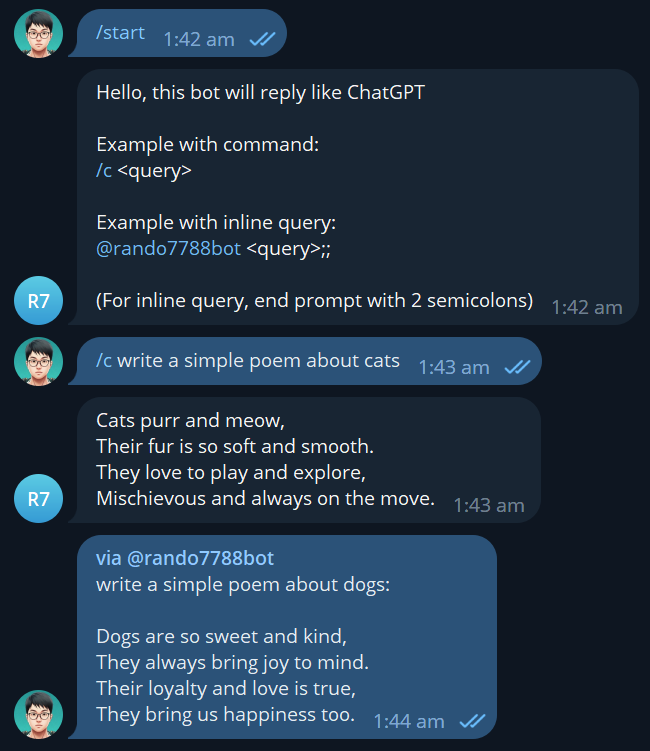

# Telegram ChatGPT Bot

Simple Telegram bot that uses OpenAI API to generate text like ChatGPT.

## Development

1) `pnpm install` 
2) Create `.local.env` based on `.example.env` and fill in config
3) `pnpm dev`

## Deployment

Hosted on AWS Lambda

## Additional Info:

Inline query ends with double semicolon so OpenAI API won't be spammed because this bot is intended to be deployed on a serverless platform without a database or cache